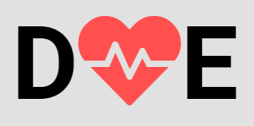

<h1 align="center">
    
</h1>

## 🚀 Projeto desenvolvido durante a 3° MaratonaDev da [Rocketseat](https://www.linkedin.com/school/rocketseat/ "Rocketseat")

### Sobre

A ideia do projeto é:

<strong>"Incentivar, encontrar e registrar doadores de sangue".</strong>

O projeto consiste na construção de uma aplicação Web para cadastro de doadores de sangue.

### Tela Web/FrontEnd.

<h1 align="center">
    
</h1>

###  Requerimentos / Dependências

Se for usar o NPM:  
`npm init`

Se for usar o Yarn:  
`yarn init`

Execute no terminal `yarn start` para iniciar o servidor (modo desenvolvedor), em seguida acesse o <strong>localhost</strong> na porta <strong>3000</strong>.

### 💻 Tecnologias

- [Node.js](https://nodejs.org/en/)
- [Nodemon](https://nodemon.io)
- [PostgreSQL](https://www.postgresql.org)
- [Nunjucks](https://mozilla.github.io/nunjucks/)

### Contato

Contato: - yarlley.silva@gmail.com
 
LinkedIn - https://www.linkedin.com/in/yarlleysilva/
